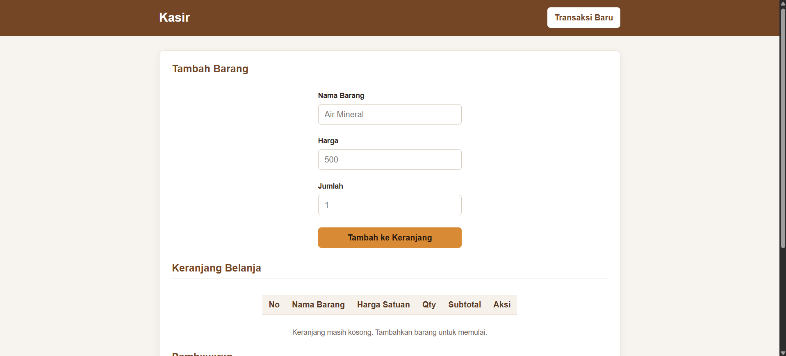

# Aplikasi Kasir & Keranjang Belanja Sederhana (Mini POS)

Mini POS merupakan aplikasi kasir sederhana berbasis web yang dibuat sebagai tugas praktikum pertemuan 1. Aplikasi ini membantu pengguna memasukkan barang belanja, menghitung total pembayaran, dan mengetahui kembalian. Proyek menggunakan HTML, CSS, dan JavaScript dasar tanpa framework atau server.

## Dokumentasi Tampilan

Berikut tampilan aplikasi saat pertama kali dibuka dengan keranjang kosong:



## Fitur

- Menambahkan barang ke keranjang menggunakan nama, harga satuan, dan jumlah.
- Memvalidasi data barang sebelum ditambahkan.
- Menampilkan daftar barang dengan nomor, nama, harga satuan, jumlah, subtotal, dan tombol hapus.
- Menampilkan pesan ketika keranjang kosong.
- Menghapus barang satu per satu dari keranjang.
- Menghitung total belanja, diskon, total akhir, dan kembalian.
- Memberikan diskon 10% jika total belanja mencapai minimal Rp50.000.
- Mendukung kode promo `HEMAT10` untuk mendapatkan diskon 10%.
- Memeriksa kecukupan uang pembayaran dan menampilkan pesan jika pembayaran kurang.
- Menyimpan isi keranjang di `localStorage`, sehingga keranjang tetap ada setelah halaman dimuat ulang di browser yang sama.
- Mengosongkan keranjang dan memulai transaksi baru.
- Menyesuaikan tampilan agar tetap dapat digunakan pada layar kecil.

## Aturan dan Validasi

| Data | Aturan |
| --- | --- |
| Nama barang | Wajib diisi dan minimal 3 karakter setelah spasi di awal/akhir diabaikan. |
| Harga | Wajib berupa angka dan minimal Rp500. |
| Jumlah | Wajib berupa bilangan bulat minimal 1. |
| Diskon otomatis | Diskon 10% diberikan saat total belanja minimal Rp50.000. |
| Kode promo | Masukkan `HEMAT10`, lalu tekan Enter untuk mengaktifkan diskon 10%. |
| Pembayaran | Jika uang bayar kurang dari total akhir, aplikasi menampilkan pesan bahwa pembayaran belum mencukupi. |

Diskon otomatis dan diskon dari kode promo menggunakan persentase yang sama, yaitu 10%; keduanya tidak dijumlahkan menjadi diskon 20%.

## Teknologi yang Digunakan

- **HTML** untuk struktur halaman dan formulir.
- **CSS** untuk tata letak, warna, dan tampilan responsif.
- **JavaScript** untuk validasi, keranjang, perhitungan, dan interaksi.
- **localStorage** untuk menyimpan data keranjang pada browser.

## Struktur Folder

```text
bagasharimuthi_124140128_pertemuan1/
├── index.html             # Struktur halaman Mini POS
├── style.css              # Gaya dan tata letak halaman
├── script.js              # Validasi dan logika aplikasi
├── README.md              # Dokumentasi proyek
└── screenshots/
    └── mini-pos.png        # Screenshot tampilan aplikasi
```

## Cara Menjalankan

1. Unduh atau salin folder proyek ke komputer.
2. Buka folder proyek.
3. Buka `index.html` menggunakan browser seperti Google Chrome atau Microsoft Edge.
4. Aplikasi siap digunakan; tidak diperlukan instalasi dependensi maupun server.

## Cara Menggunakan

1. Isi **Nama Barang**, **Harga**, dan **Jumlah**.
2. Klik **Tambah ke Keranjang**. Jika ada data yang tidak sesuai, pesan validasi akan muncul di bawah kolom terkait.
3. Periksa daftar barang dan nilai belanja pada bagian **Keranjang Belanja** dan **Pembayaran**.
4. Untuk menghapus barang, klik **Hapus** pada baris barang yang diinginkan.
5. Jika ingin menggunakan promo, isi kode `HEMAT10` pada kolom **Kode Promo**, lalu tekan Enter.
6. Isi **Uang Bayar** untuk melihat kembalian. Aplikasi menampilkan peringatan jika uang yang dimasukkan belum cukup.
7. Klik **Transaksi Baru** untuk mengosongkan keranjang dan memulai transaksi berikutnya.

## Penyimpanan Data

Data barang keranjang disimpan di penyimpanan lokal browser dengan kunci `keranjangGokil`. Data hanya tersedia pada browser dan perangkat yang sama. Tombol **Transaksi Baru** menghapus data keranjang tersimpan.

## Batasan Proyek

- Aplikasi berjalan di sisi browser dan belum terhubung ke database atau layanan backend.
- Data keranjang tidak tersinkronisasi antarperangkat atau antarbrowser.
- Kode promo `HEMAT10` ditentukan langsung di kode JavaScript dan bukan dikelola melalui sistem promo.
- Aplikasi ini merupakan proyek pembelajaran dasar, bukan sistem kasir produksi.
