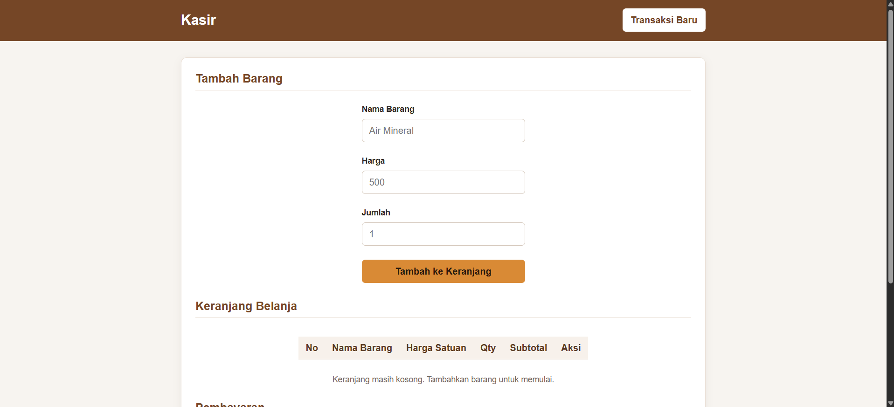
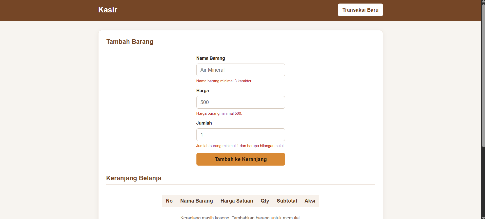
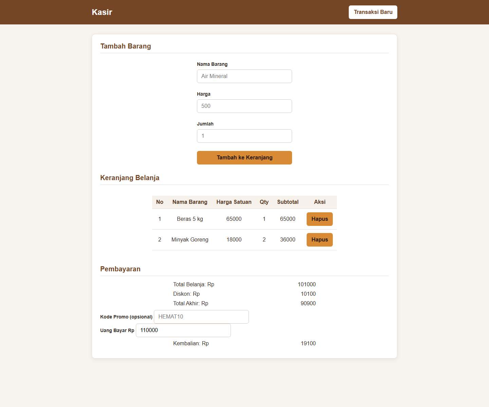

# Aplikasi Kasir & Keranjang Belanja Sederhana (Mini POS)

## Identitas

| Keterangan | Informasi |
| --- | --- |
| Nama Lengkap | Bagas Hari Muthi |
| NIM | 124140128 |
| Kelas Praktikum | RB |

## Deskripsi Aplikasi

Mini POS adalah aplikasi kasir sederhana berbasis web untuk membantu proses transaksi penjualan pada toko kecil. Pengguna dapat memasukkan barang dan jumlahnya, melihat ringkasan keranjang, menghitung diskon dan total pembayaran, lalu mengetahui kembalian.

Proyek ini dibuat sebagai tugas praktikum pertemuan 1 untuk menerapkan dasar HTML, CSS, dan JavaScript, terutama pengolahan formulir, validasi masukan, manipulasi halaman, perhitungan, serta penyimpanan data sederhana di browser.

**Studi kasus:** simulasi kasir toko kecil yang menghitung harga beberapa barang dalam satu transaksi.

## Tangkapan Layar

Screenshot berikut menunjukkan aplikasi saat awal dibuka, ketika validasi gagal, dan saat keranjang berisi barang beserta hasil perhitungan pembayaran.

### 1. Form input dan keranjang kosong



### 2. Pesan validasi input



### 3. Hasil perhitungan dan tabel keranjang

Contoh ini menggunakan Beras 5 kg seharga Rp65.000 sebanyak 1 buah dan Minyak Goreng seharga Rp18.000 sebanyak 2 buah. Total belanja Rp101.000, diskon 10% Rp10.100, total akhir Rp90.900, dan kembalian dari pembayaran Rp110.000 adalah Rp19.100.



## Fitur

- [x] Menambahkan barang dengan nama, harga, dan jumlah.
- [x] Memvalidasi nama barang minimal 3 karakter setelah spasi di awal dan akhir dihapus.
- [x] Memvalidasi harga berupa angka minimal Rp500.
- [x] Memvalidasi jumlah berupa bilangan bulat minimal 1.
- [x] Menampilkan pesan kesalahan pada kolom yang tidak valid dan mencegah barang yang tidak valid masuk ke keranjang.
- [x] Menampilkan barang, harga satuan, kuantitas, dan subtotal pada tabel keranjang aktif.
- [x] Menampilkan pesan saat keranjang kosong dan menyediakan tombol untuk menghapus barang.
- [x] Menghitung total belanja, diskon, total akhir, dan kembalian pembayaran.
- [x] Memberikan diskon 10% jika total belanja minimal Rp50.000 atau kode promo `HEMAT10` digunakan.
- [x] Menampilkan pesan ketika uang pembayaran belum mencukupi.
- [x] Menyimpan dan memuat kembali data keranjang menggunakan `localStorage`.
- [x] Mengosongkan keranjang dan data tersimpan saat tombol **Transaksi Baru** dipilih.
- [x] Menyediakan tata letak responsif untuk layar kecil.

> **Ruang lingkup kalkulator:** aplikasi menghitung nilai transaksi kasir, bukan kalkulator saldo atau anggaran bulanan. Tabel yang tersedia adalah keranjang untuk transaksi aktif; aplikasi belum memiliki riwayat transaksi terpisah.

## Aturan Diskon dan Validasi

| Bagian | Aturan |
| --- | --- |
| Nama barang | Minimal 3 karakter setelah spasi di awal/akhir diabaikan. |
| Harga barang | Angka minimal Rp500. |
| Jumlah barang | Bilangan bulat minimal 1. |
| Diskon otomatis | Diskon 10% jika total belanja minimal Rp50.000. |
| Kode promo | Ketik `HEMAT10` dengan huruf kapital, lalu tekan Enter untuk mengaktifkan diskon 10%. |
| Pembayaran | Jika uang bayar kurang dari total akhir, kembalian ditampilkan 0 dan pesan kekurangan pembayaran muncul. |

Diskon otomatis dan kode promo menggunakan tingkat diskon yang sama. Keduanya tidak dijumlahkan menjadi diskon 20%.

## Teknologi

- **HTML** — struktur halaman, formulir, tabel keranjang, dan ringkasan pembayaran.
- **CSS** — gaya visual dan tata letak responsif.
- **JavaScript** — validasi masukan, manipulasi keranjang, perhitungan, dan interaksi.
- **Web Storage API (`localStorage`)** — penyimpanan data keranjang pada browser.

## Struktur Proyek

```text
bagasharimuthi_124140128_pertemuan1/
├── index.html
├── style.css
├── script.js
├── README.md
└── screenshots/
    ├── 01-tampilan-utama.png
    ├── 02-validasi-error.png
    └── 03-hasil-perhitungan-keranjang.png
```

## Panduan Menjalankan

### Opsi 1: Membuka langsung di browser

1. Unduh atau salin folder proyek ke komputer.
2. Buka folder proyek.
3. Klik dua kali `index.html`, atau klik kanan lalu pilih **Open with** dan pilih browser.
4. Aplikasi akan terbuka di browser tanpa instalasi dependensi atau server.

### Opsi 2: Menggunakan Live Server di VS Code

1. Buka folder proyek di Visual Studio Code.
2. Pasang ekstensi **Live Server** jika belum tersedia.
3. Buka `index.html`.
4. Klik **Go Live** pada status bar atau klik kanan file lalu pilih **Open with Live Server**.
5. Browser akan terbuka ke alamat lokal Live Server. Perubahan file dapat dilihat setelah halaman dimuat ulang.

## Panduan Penggunaan

1. Masukkan nama barang, harga, dan jumlah pada bagian **Tambah Barang**.
2. Pilih **Tambah ke Keranjang**. Jika masukan tidak valid, baca pesan di bawah kolom yang perlu diperbaiki.
3. Lihat barang dan subtotal pada bagian **Keranjang Belanja**.
4. Jika perlu, pilih **Hapus** pada baris barang yang ingin dikeluarkan.
5. Periksa total belanja, diskon, dan total akhir pada bagian **Pembayaran**.
6. Untuk kode promo, masukkan `HEMAT10`, lalu tekan Enter.
7. Isi uang pembayaran untuk menghitung kembalian atau melihat pesan jika uang belum mencukupi.
8. Pilih **Transaksi Baru** untuk mengosongkan keranjang dan memulai transaksi berikutnya.

## Penjelasan Teknis Singkat

### Validasi input

JavaScript menangani event `submit` pada formulir dan mencegah pengiriman halaman dengan `preventDefault()`. Nama dibersihkan menggunakan `trim()`, harga dibaca sebagai angka, dan jumlah diperiksa menggunakan `Number.isInteger()`. Bila nama kurang dari 3 karakter, harga kurang dari Rp500/tidak valid, atau jumlah bukan bilangan bulat minimal 1, aplikasi menampilkan pesan kesalahan dan menghentikan penambahan barang.

### Kalkulasi transaksi

Fungsi `hitungJumlahSubtotal()` menjumlahkan hasil harga dikali jumlah untuk setiap barang. `hitungJumlahAkhir()` menerapkan diskon 10% bila total belanja minimal Rp50.000 atau promo valid telah digunakan, kemudian mengurangi diskon dari subtotal. Fungsi `hitungKembalian()` membandingkan pembayaran dengan total akhir: bila cukup, selisihnya menjadi kembalian; bila kurang, aplikasi menampilkan pesan kesalahan pembayaran.

### `localStorage` dan serialisasi

Saat isi keranjang berubah, `simpanKeranjang()` mengubah array barang menjadi teks JSON dengan `JSON.stringify()` dan menyimpannya pada kunci `keranjangGokil`. Saat halaman dimuat, `muatKeranjang()` mengambil teks tersebut dan mengubahnya kembali menjadi array menggunakan `JSON.parse()`. Tombol **Transaksi Baru** menghapus data tersimpan dengan `localStorage.removeItem()`. Penyimpanan ini hanya berlaku pada browser dan perangkat yang sama.

## Batasan

- Aplikasi berjalan di browser dan belum menggunakan backend atau database.
- Data keranjang tidak disinkronkan ke browser atau perangkat lain.
- Tabel hanya menampilkan keranjang transaksi aktif; belum ada pencatatan riwayat transaksi.
- Tidak ada fitur pengelolaan saldo, anggaran, atau stok barang.
- Kode promo ditentukan langsung di JavaScript dan bersifat tetap.
